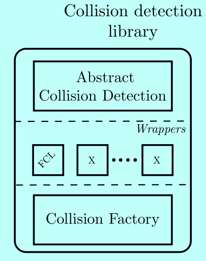

collision_detection
=============
A framework for handling collision detection. This framework contains the following collision library: fcl. The aim of this framework is to offer the user to use different types collision libraries by just changing the configuration.

The current version uses only [FCL](https://github.com/flexible-collision-library/fcl)

License
-------
BSD 3-Clause

Installation
------------
The easiest way to build and install this package is to use Rock's build system.
See [this page](http://rock-robotics.org/stable/documentation/installation.html)
on how to install Rock.

However, if you feel that it's too heavy for your needs, Rock aims at having
most of its "library" packages (such as this one) to follow best practices. See
[this page](http://rock-robotics.org/stable/documentation/packages/outside_of_rock.html)
for installation instructions outside of Rock.